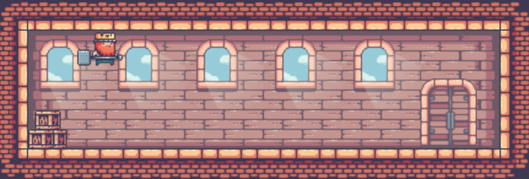
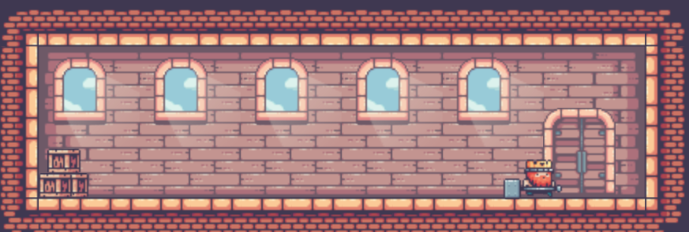
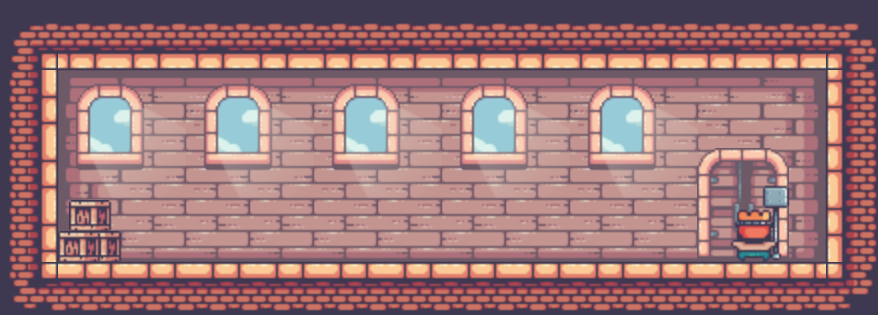
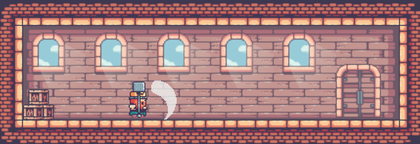

# KingsAndPigs.github.io

## Mekanikler

Oyunda 4 farklı komut girilebilir. Klasik WAD sağ, sol ve yukarı mekanikleri için ve boşluk tuşuysa saldırı animasyonunu çalıştırır. E tuşuysa Kapıyla bir etkileşim içindedir. 

- Zıplama:
   
 
   
- Koşma:
   
 
   
- Etkileşim:
   
 
   
- Saldırı:
   
 
   

## License
| Assets | README |
| ------ | ------ |
| Pixel Frog | [https://pixelfrog-assets.itch.io/kings-and-pigs/README.md] |
